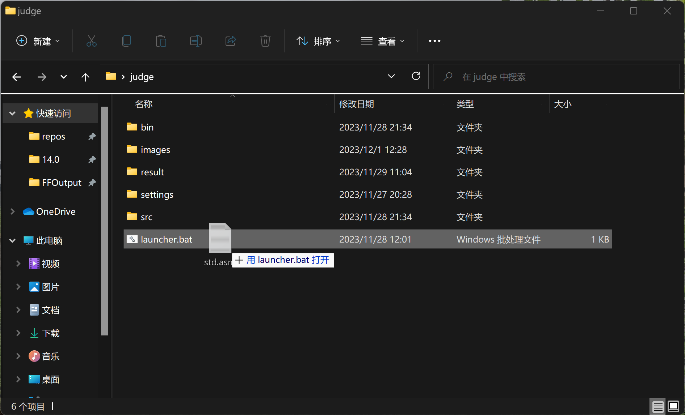
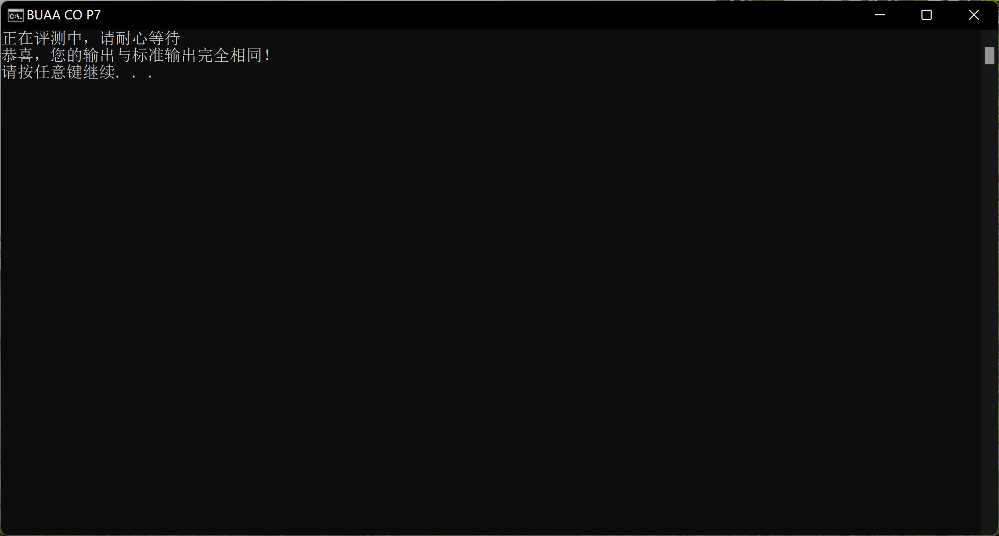
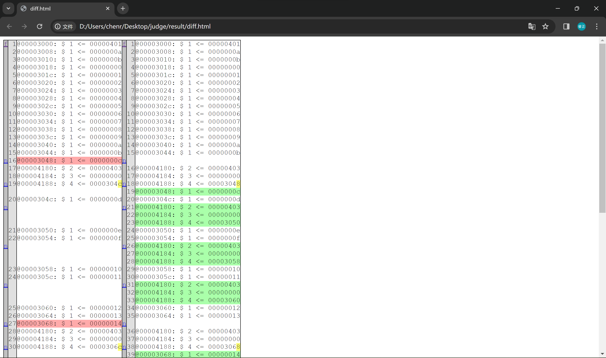

# P7 自制对拍器
## 启动方法
将压缩包内容全部解压，打开 settings 文件夹，在 ```ISEPath.txt``` 中输入 ISE 安装路径（如 ```C:\Xilinx\14.7\ISE_DS\ISE``` ），在 ```ProjectPath.txt``` 中输入待评测 ISE 项目所在路径，路径两端无需添加引号，结尾无需多余的 ```"\"``` ，且不要使用中文路径

自行构造评测数据后（需包含 ```.text``` 和 ```.ktext 0x4180``` 两部分），将 .asm 文件拖拽到 ```launcher.bat``` 上，即可开始评测；或者，双击 ```launcher.bat``` 后，将 .asm 文件拖拽到命令行窗口中，按回车即可开始评测



## 评测结果展示
若你的 CPU 输出与 Mars 输出完全相同，则会展示一行文字“恭喜，您的输出与标准输出完全相同！”



若你的 CPU 输出与 Mars 输出不完全相同，则会展示两者之间的差异，此时可自行核对（左侧为 Mars 输出，右侧为你的输出）



Mars 输出被保存在 ```result/stdans.txt``` 中，你的输出被保存在 ```result/stuans.txt``` 中，你也可以打开他们进行查看

## 评测说明
本对拍器适用于评测 CPU 中关于异常处理以及计时器中断处理的部分，对于用户提供的 .asm 文件，评测系统首先会利用 Mars 导出 ```.text``` 和 ```.ktext``` 两部分中的内容，并在 ```.text``` 结尾加入以下三条指令后，共同合并为 ```code.txt``` 进行评测
```mips
mtc0 $0,$12
label:beq $0,$0,label
nop
```
其中，beq 指令主要防止你的 CPU 运行完 ```.text``` 段指令后，自动从 0x417c 前进到 0x4180 ，造成与 Mars 行为的差异；mtc0 指令主要防止在对计时器中断处理部分进行测试时，你的 CPU 运行完 ```.text``` 段指令后仍然响应计时器中断，造成与 Mars 行为的差异

对于异常处理部分的测试，你的输出在正常情况下应与 Mars 输出一致；对于计时器中断处理部分的测试，你的输出有很大概率与 Mars 输出不一致，此时需要自行检查 CPU 输出的正确性

另外，为保证 CPU 输出顺序与 Mars 输出顺序一致，在课程组提供的官方无中断 tb 基础上，调整了寄存器信息和 DM 信息的输出顺序，详见 ```src/mips_auto_txt.v```
## 开发说明
开发语言：Windows Batch / C / Python， 压缩包内部包含源代码，供感兴趣的同学学习；此外，为尽可能使 Mars 行为贴近 CPU 行为，在课程组提供的官方 Mars 基础上，对 LargeText 模式下 $gp($28) 和 $sp($29) 寄存器的初值作出了一定修改（由 0x1800 和 0x2ffc 改为 0x0 ）

因本人时间及精力原因，暂时仅实现了对拍器，并未实现评测数据的自动生成，有待后续完善
